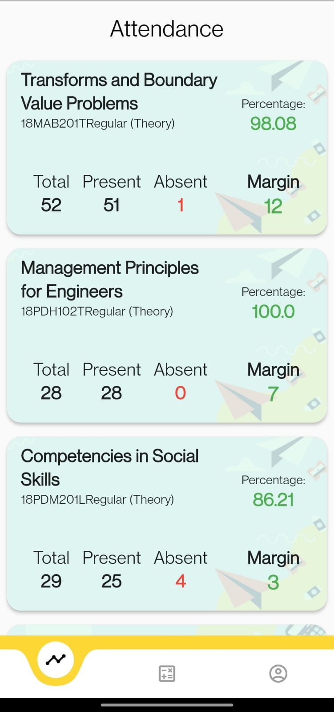
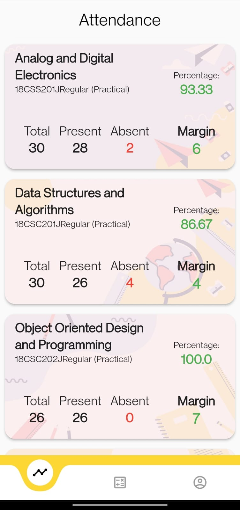
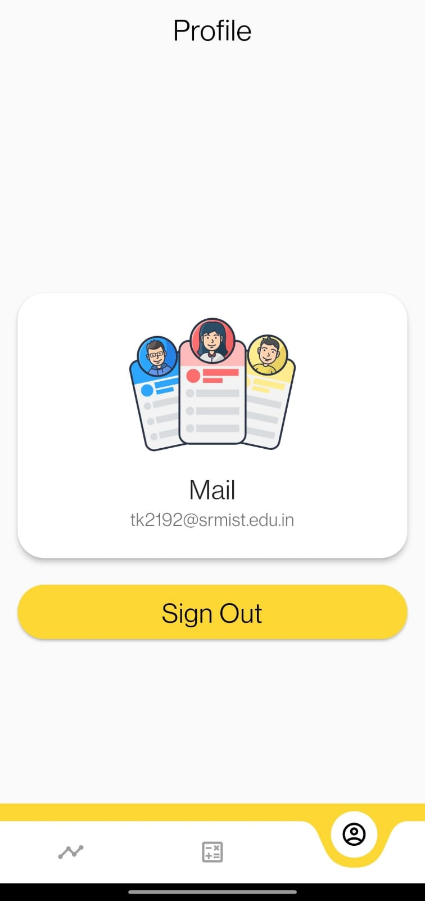

# Acadata

An app that shows all you student academia data.
(Ongoing Development)

&nbsp;&nbsp;&nbsp;&nbsp;

# Release Notes
An app to show all your Academia data into a single place with beautiful UI and easy-to-read data.

Features:
- Shows all your attendance data.
- Shows how many margins you have in classes.
- Beautiful UI which is easy to read and understand
- Stores data locally and sends none to the internet ensuring security.

Update notes:
- UI updates:
  - Added background for each card of attendance.
  - Color differentiation between theory and practical subjects.
  - Removed blue color of title bar.
- Bug fixes.
