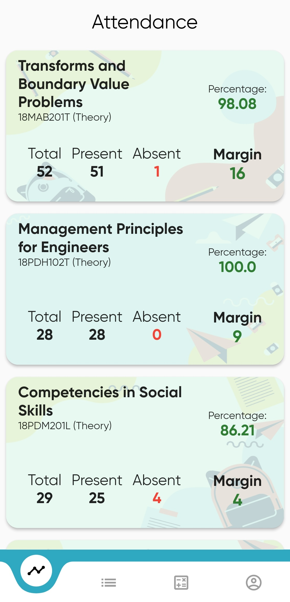
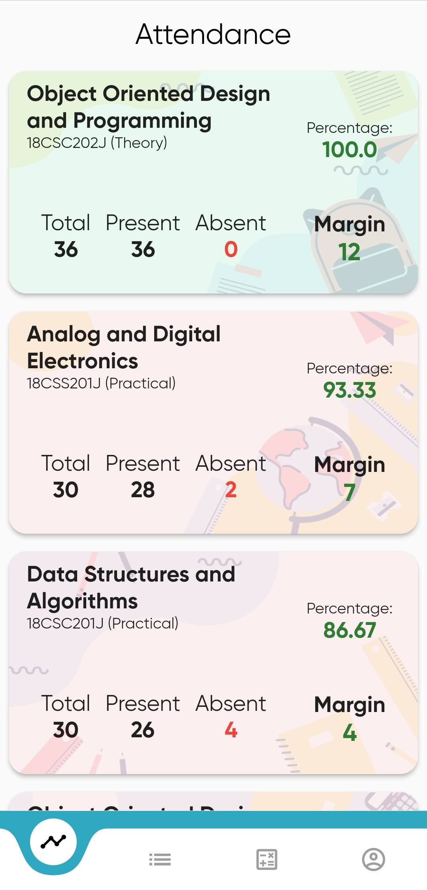
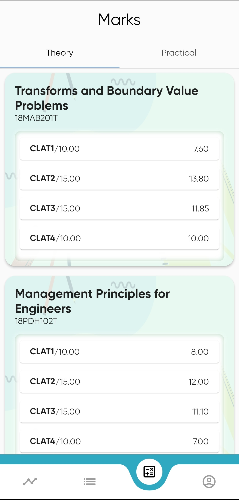
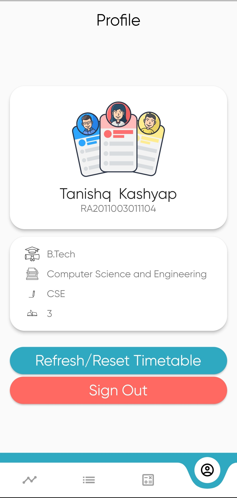

# Acadata

An app that shows all your student academia data.
(Ongoing Development)
# Screenshots

&nbsp;&nbsp;&nbsp;&nbsp;&nbsp;&nbsp;&nbsp;&nbsp;&nbsp;&nbsp;&nbsp;&nbsp;

# Release Notes
An app to show all your Academia data into a single place with beautiful UI and easy-to-read data.

Features:
- Shows all your attendance, timetable and marks data.
- Timetable can be edited as per the user's request. Unrequired subjects can now be deleted just in a simple swipe.
- Shows how many margins you have in classes.
- Beautiful UI which is easy to read and understand
- Stores data locally and sends none to the internet ensuring security.

Update notes:
- Added swipe to delete feature in timetable section.
- Added loading view to reset timetable button.
- Bugs Fixed in attendance screen.
